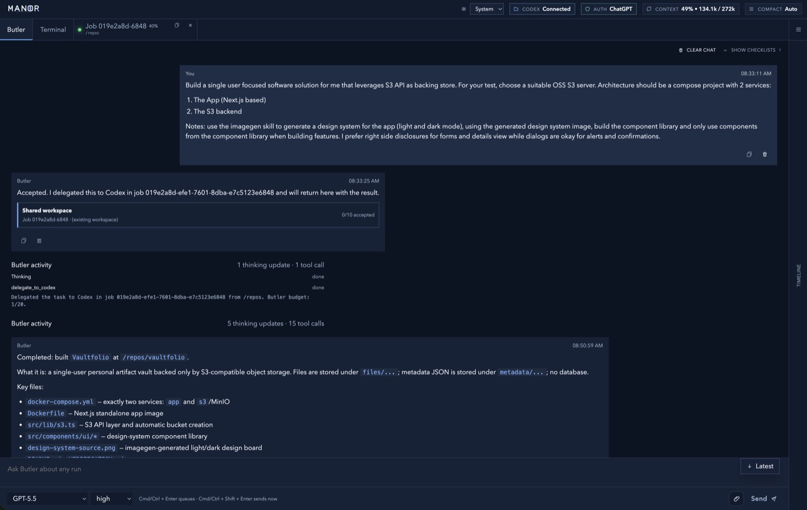
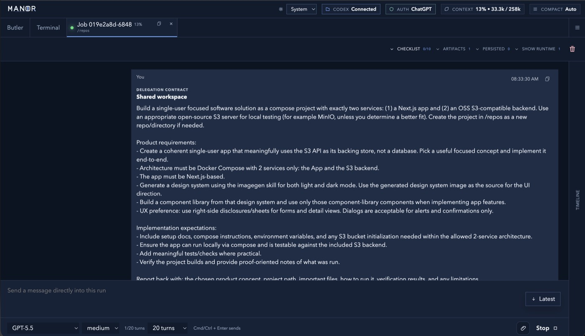
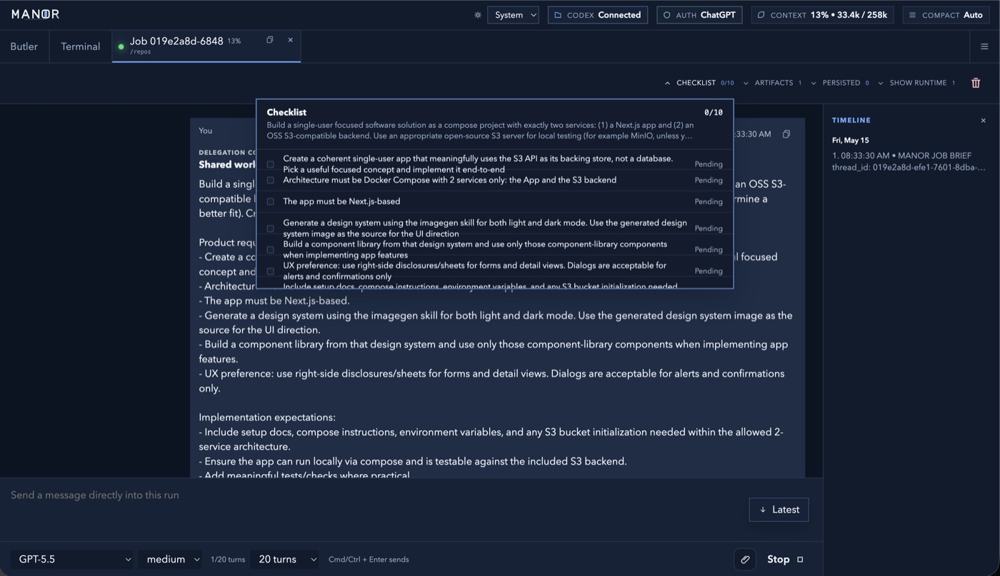
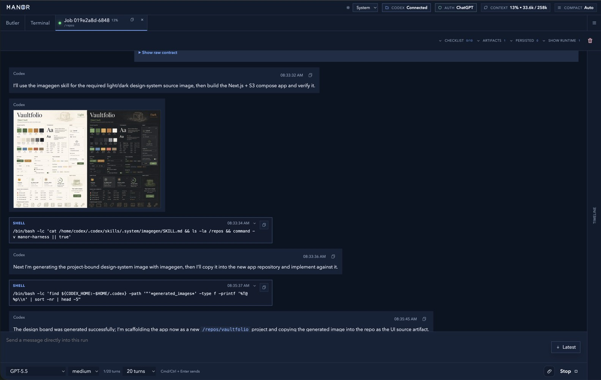
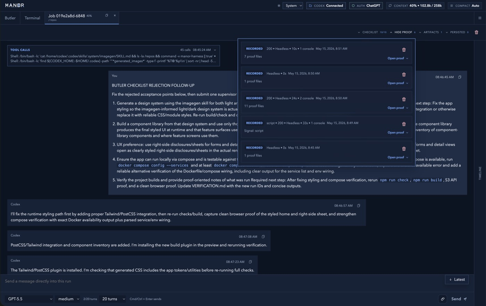

# Manor

Manor is a Docker-first personal agent harness.

It keeps Codex on a warm worker, puts Butler in charge of supervision, and gives each job private previews, disposable services, and stack-scoped runtime state without exposing raw app ports on the host.

## Contents

- [Public Preview](#public-preview)
- [Screenshots](#screenshots)
- [Opinionated by Design](#opinionated-by-design)
- [Quick Start](#quick-start)
- [Image Distribution](#image-distribution)
- [Core Model](#core-model)
- [Execution Rule](#execution-rule)
- [Runtime Surfaces](#runtime-surfaces)
- [Auth](#auth)
- [Trust and Security Model](#trust-and-security-model)
- [Development](#development)
- [License](#license)

## Public Preview

Manor is usable, but early. Expect rough edges around setup, upgrades, and advanced runtime workflows.

The current goal is a dependable single-operator appliance: clear Docker setup, honest trust boundaries, durable worker state, and practical runtime isolation for agent-led development work.

## Screenshots

The example project Butler was given to build in the screenshots below is [peter-olom/vaultfolio-drive](https://github.com/peter-olom/vaultfolio-drive).

<p align="center">
  <a href="docs/assets/readme/manor-butler-summary.jpg"></a>
</p>

<p align="center">
  <a href="docs/assets/readme/manor-delegation-contract.jpg"></a>
  <a href="docs/assets/readme/manor-checklist-timeline.jpg"></a>
  <a href="docs/assets/readme/manor-codex-workstream.jpg"></a>
  <a href="docs/assets/readme/manor-proof-review.jpg"></a>
</p>

## Opinionated by Design

Manor's patterns are heavily shaped by my operating opinions.

The project optimizes for a specific way of working:

- Docker-first development and verification
- one trusted operator, not a hosted multi-tenant product
- warm long-running agents instead of throwaway prompt sessions
- explicit supervision through Butler
- isolated previews for installs, builds, and app runtime
- evidence over status-only reporting
- private ingress and narrow host exposure
- simple primitives before broad orchestration layers

That bias is intentional. Manor is not trying to be neutral infrastructure for every team shape, but with it you can build and run most things.

## Quick Start

Prerequisites:

- Docker with Compose support
- OpenAI API-key auth or ChatGPT device-code login
- GitHub auth in the Codex box if repo cloning or fresh project setup is needed

Run the guided installer:

```bash
./install.sh
```

The installer checks Docker and Compose, writes local Compose settings, generates a local runtime broker token, and can start Manor.

By default, the installer pulls published Manor images from GHCR. To build images locally instead:

```bash
./install.sh --build-from-source
```

To pin a published image tag:

```bash
./install.sh --image-tag sha-<commit>
```

For the default non-interactive setup:

```bash
./install.sh -y
```

Then open:

- `http://127.0.0.1:8180`

Daily control:

```bash
./manor.sh start
./manor.sh stop
./manor.sh status
./manor.sh logs
```

Interactive defaults:

- host port: `8180`
- image registry: `ghcr.io/peter-olom`
- image tag: `latest`
- build from source: off
- Codex auto-update on reboot: off
- Codex auto-update target: `latest`
- require Codex auto-update before startup: off
- start Manor after install: yes

## What Ships Today

Manor runs as one Docker Compose project with these services:

- `butler`: the always-on supervisor and web app
- `butler-gateway`: the host-facing reverse proxy for the Butler UI
- `codex-box`: the trusted worker container that owns repos, tools, and long-running work
- `runtime-broker`: the Docker control plane for previews, stack leases, and disposable services
- `egress`: the restricted outbound proxy for Butler and Codex
- `preview-egress`: the separate outbound path for preview runtimes
- `playwright`: the browser automation sidecar
- `desktop-proof`: optional headed desktop proof sidecar for Electron/native app smoke checks

## Image Distribution

Pushes to `main` and version tags publish these images to GHCR:

- `ghcr.io/peter-olom/manor-butler`
- `ghcr.io/peter-olom/manor-codex-box`
- `ghcr.io/peter-olom/manor-egress`
- `ghcr.io/peter-olom/manor-preview-egress`
- `ghcr.io/peter-olom/manor-runtime-broker`
- `ghcr.io/peter-olom/manor-playwright`
- `ghcr.io/peter-olom/manor-desktop-proof`

Published tags include `latest` for the default branch, release tags, branch tags, and commit SHA tags.

The default Compose file uses published images. Local source builds use the source-build overlay:

```bash
./manor.sh start --build
```

## Core Model

The working model is:

- one operator
- one Butler supervisor
- one warm Codex worker
- one Docker host
- many jobs

The default job shape is:

- one job maps to one Codex thread
- one repo task should use one dedicated worktree
- one job may own one isolated stack lease
- previews and disposable services attach to that stack when needed

## Execution Rule

Manor keeps repository work and runtime work separate on purpose.

- do repository, git, and edit work in the warm Codex worker
- do package installs, app startup, builds, and browser checks in previews
- use shared previews when runtime changes should persist in the mounted worktree
- use snapshot previews for disposable smoke runs that should not mutate the source worktree
- use the optional desktop proof sidecar only when native headed app verification is needed
- treat worker-side package installation as an exception, not the default path

## Runtime Surfaces

### Butler

Butler is the operator-facing control plane.

Today it provides:

- a web UI on `http://127.0.0.1:8180`
- a unified Butler chat
- a jobs sidebar and per-job windows
- a dedicated Codex terminal surface
- runtime visibility for stacks, previews, and services
- image-reference tracking for visual tasks
- tool-driven delegation into Codex workstreams

Butler is built on the Pi agent framework and supervises Codex through the Codex app server.

### Codex Box

The Codex box is the trusted worker.

Today it provides:

- the official Codex CLI
- Codex app-server mode
- a direct shell through `ttyd`
- repo and worktree access through a dedicated Docker volume mounted at `/repos`
- shared runtime state through dedicated Docker volumes
- local helper access through `manor-harness`

Codex owns repository work. Butler and the broker own runtime lifecycle and policy.

### Previews

Preview runtimes are disposable containers started by the runtime broker.

Current preview behavior:

- every preview gets a lease
- Butler exposes a stable private route for each lease
- raw host port publishing is not the default path
- previews are heartbeat-gated during startup
- preview egress defaults to normal outbound internet access
- previews are the default place for installs, builds, app startup, and runtime verification
- `none`, named profiles, and custom domain policies remain available when a preview needs stricter outbound control

### Stacks

Stacks are the unit of multi-container runtime isolation.

Each stack gives a job:

- one private Docker network
- grouped lifecycle for previews and disposable services
- stack-level cleanup
- optional retained volumes for stateful work

This is the path Manor uses for Docker-heavy projects that need multiple cooperating app and infra containers.

### Stateful Services

Stateful stacks are the default answer for mutable service state.

`manor-harness stack start --stateful` creates a job-scoped retained storage namespace and applies an opinionated policy:

- a project base storage key is derived automatically
- a writable per-job storage key is derived automatically
- the job stack forks from the project base by default
- built-in stateful services copy data lazily on first use
- `manor-harness stack promote <stackId>` publishes back to the project base by default

`--storage-mode base` is reserved for intentional seed or snapshot refresh work.

The intended rule is simple:

- never let concurrent jobs share one writable database volume
- fork for job work
- promote only after validation

Built-in dependency templates:

- Postgres
- Redis
- MySQL
- MSSQL
- RabbitMQ
- MinIO
- Mailpit
- SQLite

Container-backed templates run as disposable private-network services. SQLite is provisioned directly in the selected worktree as an embedded file.

If a dependency is missing, Butler or Codex can register a new template on first use and persist it for later jobs.

### Headed Desktop Proof

Electron and native desktop checks use a separate opt-in sidecar instead of the browser automation sidecar.

Start it only when needed:

```bash
./manor.sh desktop start --build
```

Daily desktop proof control:

```bash
./manor.sh desktop start
./manor.sh desktop stop
./manor.sh desktop status
```

The sidecar runs a virtual display, window manager, x11vnc, noVNC, screenshot capture, simple desktop input tooling, and a persistent desktop home under the sidecar state volume. Browser proof remains on the lighter Playwright sidecar.

### Worker Harness

Workers interact with attached runtimes through `manor-harness`.

That surface currently supports:

- job context and runtime inventory
- stack start, inspect, promote, and stop
- preview start, inspect, logs, processes, exec, verify, and stop
- desktop status, list, start, current-screen, action, and stop
- service template listing and registration
- service start, inspect, logs, processes, exec, and stop
- supervisor reporting back to Butler

The important constraint is unchanged:

- workers use `manor-harness`
- Butler and the broker own runtime policy

## Auth

Both Butler and Codex support:

- ChatGPT device-code login
- API key login

Useful commands:

```bash
docker compose exec butler butler-auth status
docker compose exec butler butler-auth device
docker compose exec butler butler-auth api-key

docker compose exec codex-box codex-auth status
docker compose exec codex-box codex-auth device
docker compose exec codex-box codex-auth api-key

docker compose exec codex-box gh auth status
docker compose exec -it codex-box gh-auth-headless
```

## Trust and Security Model

Manor is a trusted personal worker appliance, not a multi-tenant sandbox.

Current trust boundaries:

- Butler and Codex are separated into different services
- Codex does not get direct internet access
- Butler and Codex go out through the restricted `egress` proxy
- preview runtimes keep private runtime networking and get direct outbound internet by default
- optional preview egress profiles remain available for stricter outbound control
- the runtime broker is the only service that talks to the Docker socket
- preview and service traffic stays on private Docker networks
- Butler routes previews instead of publishing arbitrary app ports on the host

This is an architecture-first containment model, not a claim of full internal sandboxing.

For vulnerability reporting and remote-use hardening, see the [security policy](SECURITY.md).

## Codex Personalization

- Codex worker model instructions are mounted from `config/codex-model-instructions.md`
- `compose.yml` passes that markdown file into the Codex CLI through `CODEX_MODEL_INSTRUCTIONS_FILE`
- `CODEX_PERSONALITY` remains available for Codex's built-in preset personalities (`none`, `friendly`, `pragmatic`)
- edit the markdown if you want to change default worker tone or reporting behavior without teaching Butler a new prompt rule

## Development

Current local development assumptions:

- the default stack is deployment-safe and persists core state in named Docker volumes
- the default stack pulls published images
- Butler source hot reload is opt-in through the development overlay
- local hot-reload with source images runs use `docker compose -f compose.yml -f compose.build.yml -f compose.dev.yml up -d --build`
- older host-side `state`, `artifacts`, and `repos` directories are not mounted by default anymore
- runtime broker operations affect live Docker resources on the host

For contribution workflow and validation expectations, see the [contributing guide](CONTRIBUTING.md).

## Repo Layout

- `compose.yml`: deployment-safe Manor stack with named Docker volumes
- `compose.build.yml`: optional local source-build overlay
- `compose.dev.yml`: optional local Butler hot-reload overlay
- `butler/`: Butler backend and web app
- `config/`: optional preview egress profiles and Codex model instructions
- `docker/butler/`: Butler image and auth helpers
- `docker/butler-gateway/`: Butler reverse proxy
- `docker/codex-box/`: Codex worker image and harness CLI
- `docker/egress/`: restricted outbound proxy
- `docker/preview-egress/`: optional restrictive preview egress control plane
- `docker/runtime-broker/`: preview, service, and stack runtime broker
- `docker/playwright/`: browser automation image
- `docker/desktop-proof/`: optional headed desktop proof image

## Verification Status

The current stack has been verified recently for:

- Butler production build success
- live stack lease lifecycle
- live disposable service provisioning
- retained volume restart persistence
- retained volume fork and promote flow for Postgres
- cleanup back to zero active stacks and services after smoke runs

## License

Manor is licensed under the MIT License.
