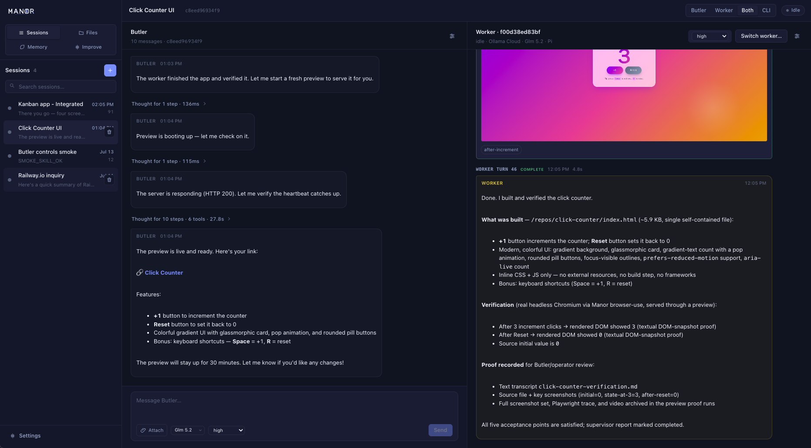

# Manor

Manor is a Docker-first personal agent workspace.

It puts Butler in charge of supervision, routes work to provider-backed Workers, and gives each job private previews, disposable services, and stack-scoped runtime state without exposing raw app ports on the host.

## Contents

- [Public Preview](#public-preview)
- [Screenshot](#screenshot)
- [Opinionated by Design](#opinionated-by-design)
- [Quick Start](#quick-start)
- [Source Distribution](#source-distribution)
- [Core Model](#core-model)
- [Execution Rule](#execution-rule)
- [Async Verification Model](#async-verification-model)
- [Runtime Surfaces](#runtime-surfaces)
- [Auth](#auth)
- [Trust and Security Model](#trust-and-security-model)
- [Worker Configuration](#worker-configuration)
- [Development](#development)
- [License](#license)

## Public Preview

Manor is usable, but early. Expect rough edges around setup, upgrades, and advanced runtime workflows.

The current goal is a dependable single-operator appliance: clear Docker setup, honest trust boundaries, durable worker state, and practical runtime isolation for agent-led development work.

## Screenshot

Butler supervises the task on the left while the active Worker and its verification evidence remain visible on the right.

[](docs/assets/readme/manor-workspace.png)

## Opinionated by Design

Manor's patterns are heavily shaped by my operating opinions.

The project optimizes for a specific way of working:

- Docker-first development and verification
- one trusted operator, not a hosted multi-tenant product
- warm long-running agents instead of throwaway prompt sessions
- explicit supervision through Butler
- isolated previews for installs, builds, and app runtime
- evidence over status-only reporting
- private ingress and narrow host exposure
- simple primitives before broad orchestration layers

That bias is intentional. Manor is not trying to be neutral infrastructure for every team shape, but with it you can build and run most things.

## Quick Start

Prerequisites:

- Docker with Compose support
- at least one supported Worker provider: OpenAI/Codex, Ollama Local, Ollama Cloud, or OpenCode Go
- GitHub auth in the Worker host when that Worker needs repo cloning or fresh project setup

Run the guided installer:

```bash
./manor-start install
```

The installer checks Docker and Compose, validates configuration before replacing the local settings file, generates local control tokens, builds Manor from the current checkout, and waits for the stack to become healthy. Source builds are the supported lifecycle path so Manor can restart directly from its own working tree, including uncommitted experiments.

For the default non-interactive setup:

```bash
./manor-start install -y
```

Then open:

- `http://127.0.0.1:8180`

Daily control:

```bash
./manor-start
./manor-start stop
./manor-start status
./manor-start logs
```

`manor-start` is the canonical launcher. Before every command it checks for an executable, gitignored `manor-start.local`. Use that file for machine-specific environment or secret-manager injection without committing private configuration:

```bash
cp manor-start.local.example manor-start.local
chmod +x manor-start.local
```

The local launcher should finish by calling `manor-start` again. The included example uses the recursion-safe bypass automatically.

Self-improvement also uses the active checkout. Manor leaves changes uncommitted, rebuilds directly from the working tree when a restart is authorized, and never resets or cleans user files. If the changed source cannot start, the host controller rebuilds clean `HEAD` and brings Manor back while leaving the experiment in place for troubleshooting.

Restart the current stack through the host controller:

```bash
./update.sh
```

Update the current source branch before rebuilding and restarting:

```bash
./update.sh --latest
```

Interactive defaults:

- host port: `8180`
- start Manor after install: yes

## What Ships Today

Manor runs as one Docker Compose project with these services:

- `butler`: the always-on supervisor and web app
- `butler-gateway`: the host-facing reverse proxy for the Butler UI
- `worker`: the Pi RPC Worker host
- `runtime-broker`: the Docker control plane for previews, stack leases, and disposable services
- `host-controller`: the narrow restart/update sidecar that survives Manor appliance restarts
- `egress`: the restricted outbound proxy for Butler and Worker execution
- `preview-egress`: the separate outbound path for preview runtimes
- `playwright`: the browser automation sidecar
- `desktop-proof`: optional headed desktop proof sidecar for Electron/native app smoke checks

## Source Distribution

Manor is distributed as source. Clone or pull the repository, then use the official launcher to build the local container images from the active checkout:

```bash
./manor-start
```

## Core Model

The working model is:

- one operator
- one Butler supervisor
- one active Worker per Butler pair
- one selected provider, model, and reasoning option for that Worker
- one Docker host
- many jobs

Worker names the product role across model providers and CLIs. Manor runs every Worker through Pi RPC. OpenAI/Codex, Ollama Local, Ollama Cloud, and OpenCode Go supply the models and provider-specific authentication while Pi owns the session and transport behavior.

The default job shape is:

- one job maps to one provider-backed Worker session
- one repo task should use one dedicated worktree
- one job may own one isolated stack lease
- sticky stack and preview leases can be reused by later jobs when warm runtime state is intentional
- previews and disposable services attach to that stack when needed

Switching an active Worker to another provider or model starts a cold handoff. Manor carries forward the task, workspace, acceptance state, proof context, and lineage. Provider caches and hidden reasoning state do not transfer.

## Execution Rule

Manor keeps repository work and runtime work separate on purpose.

- do repository, git, and edit work in the active Worker
- do package installs, app startup, builds, and browser checks in previews
- use snapshot previews for app startup, builds, and disposable smoke runs
- use sticky stack or preview leases when the operator wants a warm reusable runtime across jobs
- use the optional desktop proof sidecar only when native headed app verification is needed
- treat worker-side package installation as an exception, not the default path

### Installing Worker CLIs

Standalone CLIs can be installed from the Worker CLI when their installer supports an unprivileged destination under `~/.local`. Manor keeps `~/.local` and `~/.config` on persistent Worker volumes, so the executable and its user configuration survive normal restarts and container recreation. Removing those volumes also removes the installed tools and configuration.

Outbound access remains restricted. Add any required installer, release, API, or control-plane hostnames that are not built in through **Settings → Network**. Runtime egress changes apply immediately. Allow subdomains only when the CLI needs them. For example, Asiri can install its binary under `~/.local/bin`, while `asiri.dev` must be allowed for its API requests.

Tools that require `apt`, root access, system-wide paths, or additional operating-system libraries must use the Power User workflow: bake them into the Worker image and rebuild Manor. A user-space CLI that depends on a missing system library belongs in that image as well. This keeps the system layer reproducible while allowing self-contained CLIs to be installed when needed.

## Async Verification Model

Manor is built for async work. The operator should be able to state intent, step back, and get a reviewed outcome instead of supervising every command.

For delegated implementation, investigation, debugging, UI, API, deploy, and verification work, Butler now turns the request into an internal execution contract:

- an inferred work standard, kept out of the UI
- a task category, such as UI, API, deploy, docs, data, writing, or generic code
- a verification matrix mapped to the acceptance points
- expected evidence for each row
- Butler-owned acceptance after the worker reports back

The Worker submits evidence. Butler accepts, rejects, or waives it.

Weak reports are expected to be pushed back privately. UI work needs screenshot or video proof plus responsive, accessibility, and taste review. API work needs request-level smoke evidence, failure-path evidence, and log or runtime review. Final operator closeout should read like a compact proof dossier: what changed, what Butler accepted, what proof was reviewed, and what risk remains.

The operator should see better outcomes and better proof. They should not have to pick a depth setting or read the whole worker transcript to trust the result.

## Runtime Surfaces

### Butler

Butler is the operator-facing control plane.

Today it provides:

- a web UI on `http://127.0.0.1:8180`
- a unified Butler chat
- a jobs sidebar and per-job windows
- a Worker workstream with one operational Worker CLI
- runtime visibility for stacks, previews, and services
- image-reference tracking for visual tasks
- tool-driven delegation into provider-backed Worker jobs

Butler is built on the Pi agent framework. Its supervisor stays in the Butler environment, while every provider-backed Worker session runs through Pi RPC in the separate Worker environment.

### Worker Runtime

Workers share one Pi-backed supervision and runtime contract across providers.

The Worker environment provides:

- the Pi RPC Worker runtime
- one direct Worker CLI through `ttyd`
- repo and worktree access through a dedicated Docker volume mounted at `/repos`
- shared runtime state through dedicated Docker volumes
- local helper access through `manor-harness`

The Pi RPC harness provides Worker sessions for Manor's supported OpenAI/Codex, Ollama Local, Ollama Cloud, and OpenCode Go providers. These sessions execute in the Worker environment and receive the same job payload, workspace access, harness capabilities, reporting contract, and Butler review.

The `worker` service runs in the `manor-worker` container. Its runtime identity is `worker@manor-worker`, and it hosts the complete Worker environment. The UI exposes exactly two agent CLIs: Butler CLI and Worker CLI.

Workers own repository work. Butler and the broker own runtime lifecycle and policy.

### Previews

Preview runtimes are disposable containers started by the runtime broker.

Current preview behavior:

- every preview gets a lease
- sticky preview leases can stay warm for later jobs
- Butler exposes a stable private route for each lease
- previews are gateway-only and do not publish raw host ports
- previews are heartbeat-gated during startup
- preview egress defaults to normal outbound internet access
- previews are the default place for installs, builds, app startup, and runtime verification
- `none`, named profiles, and custom domain policies remain available when a preview needs stricter outbound control

### Stacks

Stacks are the unit of multi-container runtime isolation.

Each stack gives a job:

- one private Docker network
- grouped lifecycle for previews and disposable services
- stack-level cleanup
- optional sticky retention for reuse by later jobs
- optional retained volumes for stateful work

This is the path Manor uses for Docker-heavy projects that need multiple cooperating app and infra containers.

### Stateful Services

Stateful stacks are the default answer for mutable service state.

`manor-harness stack start --stateful` creates a job-scoped retained storage namespace and applies an opinionated policy:

- a project base storage key is derived automatically
- a writable per-job storage key is derived automatically
- the job stack forks from the project base by default
- built-in stateful services copy data lazily on first use
- `manor-harness stack promote <stackId>` publishes back to the project base by default

`--storage-mode base` is reserved for intentional seed or snapshot refresh work.

The intended rule is simple:

- never let concurrent jobs share one writable database volume
- fork for job work
- promote only after validation

Built-in dependency templates:

- Postgres
- Redis
- MySQL
- MSSQL
- RabbitMQ
- MinIO
- Mailpit
- SQLite

Container-backed templates run as disposable private-network services. SQLite is provisioned directly in the selected worktree as an embedded file.

If a dependency is missing, Butler or a Worker can register a new template on first use and persist it for later jobs.

### Headed Desktop Proof

Electron and native desktop checks use a separate opt-in sidecar instead of the browser automation sidecar.

Start it only when needed:

```bash
./manor-start desktop start
```

Daily desktop proof control:

```bash
./manor-start desktop start
./manor-start desktop stop
./manor-start desktop status
```

The sidecar runs a virtual display, window manager, x11vnc, noVNC, screenshot capture, simple desktop input tooling, and a persistent desktop home under the sidecar state volume. Browser proof remains on the lighter Playwright sidecar.

### Worker Harness

Workers interact with attached runtimes through `manor-harness`.

That surface currently supports:

- job context and runtime inventory
- stack start, inspect, lease update, promote, and stop
- preview start, inspect, lease update, logs, processes, exec, verify, and stop
- desktop status, list, start, current-screen, action, and stop
- service template listing and registration
- service start, inspect, logs, processes, exec, and stop
- supervisor reporting back to Butler with point-specific evidence

The important constraint is unchanged:

- workers use `manor-harness`
- Butler and the broker own runtime policy

## Auth

OpenAI Workers use Pi's OpenAI provider authentication. Butler supports ChatGPT device-code login and OpenAI API-key login, then makes that credential source available to the Worker runtime.

Ollama Local does not need external provider credentials. Ollama Cloud and OpenCode Go use their provider API keys. Configure and validate every enabled provider in Settings before assigning it Worker jobs.

Useful commands:

```bash
docker compose exec butler butler-auth status
docker compose exec butler butler-auth device
docker compose exec butler butler-auth api-key

docker compose exec worker gh auth status
docker compose exec -it worker gh-auth-headless
```

## Trust and Security Model

Manor is a trusted personal worker appliance, not a multi-tenant sandbox.

Current trust boundaries:

- Butler and the Worker host are separate services
- Butler contains only its own Pi-backed supervisor agent
- Pi RPC Worker sessions execute in the Worker host
- Worker execution does not get direct internet access
- external outbound traffic from Butler and Worker execution goes through the restricted `egress` proxy; local Ollama traffic stays inside the appliance
- operators can add or remove trusted runtime hostnames in Settings → Network; changes apply live to the shared Butler and Worker proxy while built-in domains remain read-only
- user-installed Worker CLIs persist in the Worker tools volume and remain unprivileged
- preview runtimes keep private runtime networking and get direct outbound internet by default
- optional preview egress profiles remain available for stricter outbound control
- the runtime broker talks to the Docker socket for scoped preview, stack, service, browser, and proof capabilities
- the host controller talks to the Docker socket only for the fixed Manor restart/update capability
- the host controller uses its own token, separate from the runtime broker token
- preview and service traffic stays on private Docker networks
- Butler routes previews instead of publishing arbitrary app ports on the host

This is an architecture-first containment model, not a claim of full internal sandboxing.

For vulnerability reporting and remote-use hardening, see the [security policy](SECURITY.md).

## Worker Configuration

Butler builds the shared delegation, runtime, proof, and reporting instructions for every Worker. Provider availability, model discovery, and reasoning options come through Pi and the selected provider's discovery and transform rules.

## Development

Current local development assumptions:

- the default stack is deployment-safe and persists core state in named Docker volumes
- the official launcher builds local images and mounts the active checkout into the relevant execution services
- an executable `manor-start.local` is always consulted first for machine-local environment injection
- Butler source hot reload is opt-in through the development overlay
- local hot reload runs use `./manor-start start --dev`
- older host-side `state`, `artifacts`, and `repos` directories are not mounted by default anymore
- runtime broker operations affect live Docker resources on the host

For contribution workflow and validation expectations, see the [contributing guide](CONTRIBUTING.md).

## Repo Layout

- `compose.yml`: deployment-safe Manor stack with named Docker volumes
- `compose.build.yml`: source-build overlay used by the official launcher
- `compose.dev.yml`: optional local Butler hot-reload overlay
- `butler/`: Butler backend and web app
- `config/`: optional preview egress profiles
- `docker/butler/`: Butler image and auth helpers
- `docker/butler-gateway/`: Butler reverse proxy
- `docker/worker/`: image for the Pi RPC Worker and Worker CLI
- `docker/egress/`: restricted outbound proxy
- `docker/host-controller/`: restart/update controller with its own scoped token
- `docker/preview-egress/`: optional restrictive preview egress control plane
- `docker/runtime-broker/`: preview, service, and stack runtime broker
- `docker/playwright/`: browser automation image
- `docker/desktop-proof/`: optional headed desktop proof image

## Verification Status

The current stack has been verified recently for:

- Butler production build success
- live stack lease lifecycle
- live disposable service provisioning
- retained volume restart persistence
- retained volume fork and promote flow for Postgres
- cleanup back to zero active stacks and services after smoke runs

## License

Manor is licensed under the MIT License.
